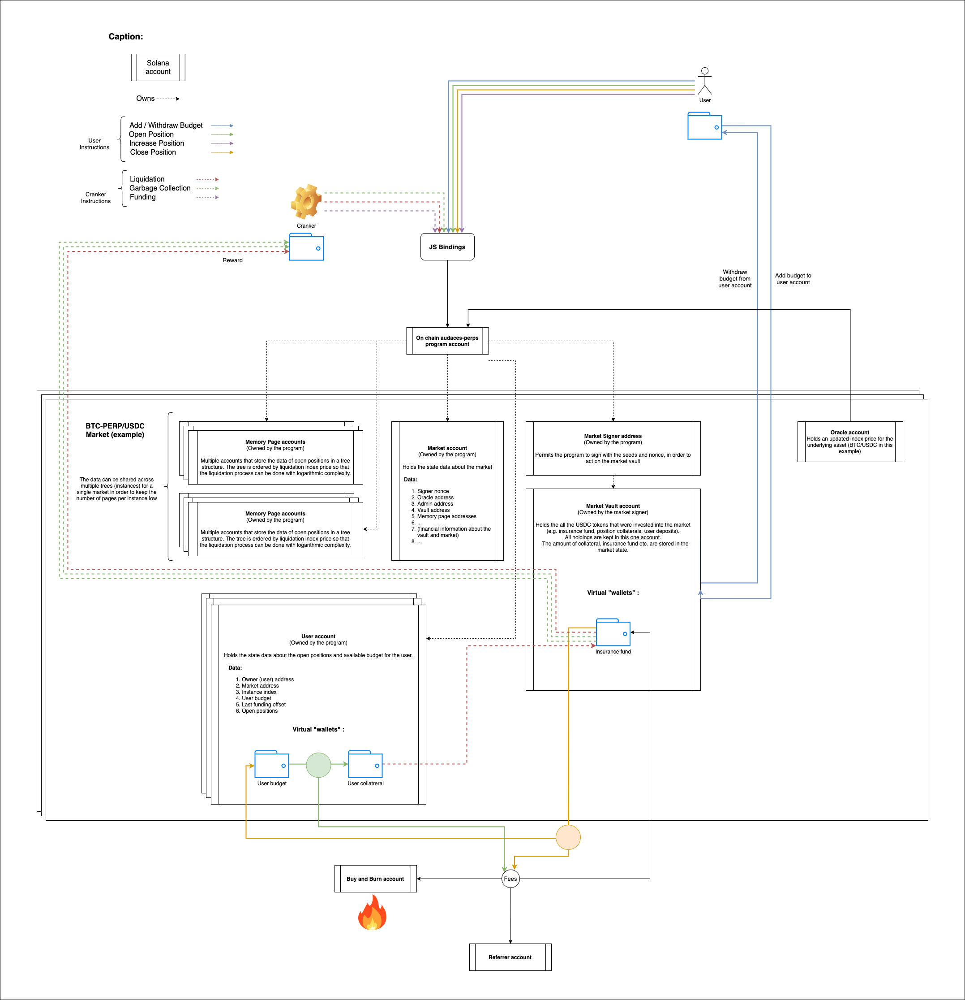
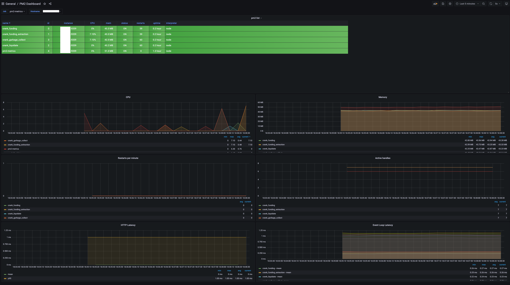

# Audaces Protocol

## ⚠️ Warning

Any content produced by Audaces Foundation, or developer resources that Audaces Foundation provides, are for educational and inspiration purposes only. Audaces does not encourage, induce or sanction the deployment of any such applications in violation of applicable laws or regulations.

Perpetuals built on Solana

White paper: [https://arweave.net/MDXO3eeOjQdmkq_E94Ah2gTS_RuKtrm0ZvTexriOh4M](https://arweave.net/MDXO3eeOjQdmkq_E94Ah2gTS_RuKtrm0ZvTexriOh4M)

- [On-chain Program](#on-chain-program)
- [Insurance fund protection](#insurance-fund-protection)
- [vAMM State](#vamm-state)
- [Cranker](#cranker)
- [JS Library](#js-library)

## Markets:

- BTC/USDC: `475P8ZX3NrzyEMJSFHt9KCMjPpWBWGa6oNxkWcwww2BR`

## On-chain Program

The on chain Audances Perpetual program maintains the vAMM state as well as a compressed liquidation index-addressable record of all open positions. It manages the creation of user accounts, the opening, closing and modifying of positions. It implements a constant-time liquidation engine which allows for a complete liquidation cycle at each Solana slot.

## Insurance fund protection

- Fallback insurance is multi sig locked
- Small effective insurance fund is owned by the program

## vAMM State

- Seed Nonce for vAMM signer program account
- Oracle address
- Audaces signer address
- Insurance fund holdings
- Vec of (
  leverage,
  (short_pt, long_pt),
  gc_hd_pt,
  Vec of (Pubkey, PageInfo) for position_books
  )

vAMM == MARKET



## Cranker

Perpetual nodes secure the Audaces protocol by cranking transactions. Anyone can run a node and help secure the protocol. The cranking transactions are:

- Liquidations
- Funding rates
- Funding extraction
- Garbage collection

💡 The cranker can be deployed on a small VPS, for instance an [AWS LightSail VPS](https://aws.amazon.com/lightsail) or a [Bahnhof VPS](https://www.bahnhof.net).

### Cranking with Ansible

The repository contains an [Ansible](https://www.ansible.com/) playbook to automate the entire set up of the server. In order to deploy the cranker, you will only need to change the `hosts.yaml` file. For example, let's say you want to deploy a cranker in two AWS zones: Dublin and Tokyo, the `hosts.yaml` file could look like

```yaml
tokyo:
  hosts:
    tokyo_1:
      ansible_host: ip_of_your_server
      ansible_ssh_private_key_file: path_to_your_ssh_key_file

dublin:
  hosts:
    dublin_1:
      ansible_host: ip_of_your_server
      ansible_ssh_private_key_file: path_to_your_ssh_key_file
```

You also need to setup the wallet with which you want to crank using the `wallet.json` file in the `cranker` folder. You can then deploy your node using Ansible by running the following commands

- For the first time set up of your server use:

```
ansible-playbook -i hosts.yaml setup.yaml
```

- To update your node

```
ansible-playbook -i hosts.yaml update.yaml
```

You can monitor your node using [pm2-metrics](https://www.npmjs.com/package/pm2-metrics) and [Grafana](https://grafana.com/) using a [Prometheus](https://prometheus.io/) datasource



### Cranking locally

If you want to crank on your local machine and already have Rust installed you can simply run the following

```
cd cranker
cargo build --release
target/release/./perps-crank --url <rpc_endpoint> --market <market_address> --program-id <program_id> --fee-payer <path_to_your_wallet> <service>
```

Where `<service>` is in: `funding`, `funding-extraction`, `liquidate` and `garbage-collect`

To install Rust on your machine refer to [https://rustup.rs/](https://rustup.rs/)

One can also use the process manager [PM2](https://pm2.keymetrics.io/) to launch the crankers

```
yarn global add pm2
<!-- Or with NPM -->
npm install pm2 -g
```

### Cranking incentives

| Cranker            | Reward                           |
| ------------------ | -------------------------------- |
| Liquidate          | 10% of the position's collateral |
| Garbage Collect    | 0.1 USDC per freed slot          |
| Funding            | None                             |
| Funding Extraction | None                             |

## JS Library

A JavaScript client library for interacting with the on-chain program. This library can be used for:

- Creating markets
- Trading on a market
- Fetching market data
- Cranking (Rust sample code is recommended ⚠️)

To install it

```
npm i @audaces/perps
```

```
yarn add @audaces/perps
```

The JS Library documentation can be generated using

```
yarn doc
```
